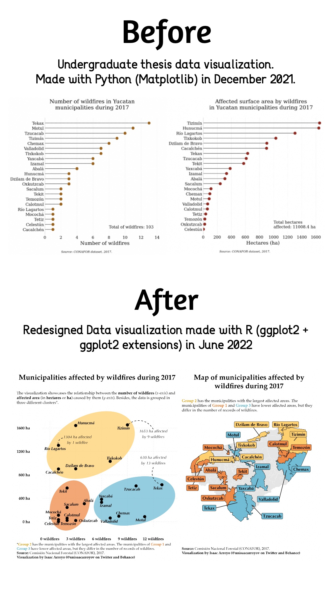
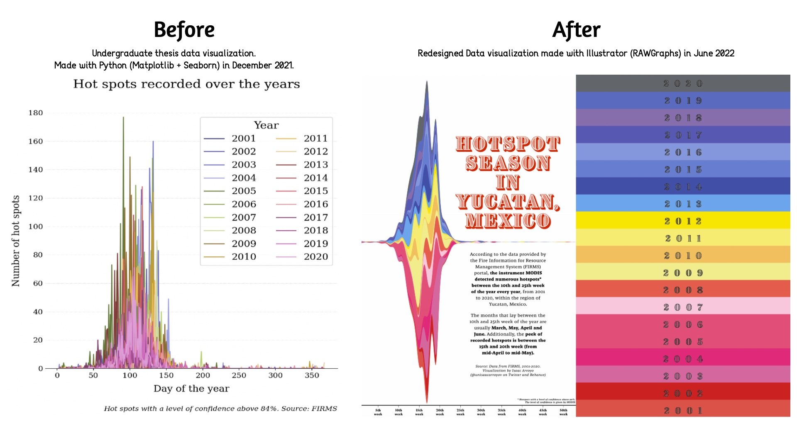
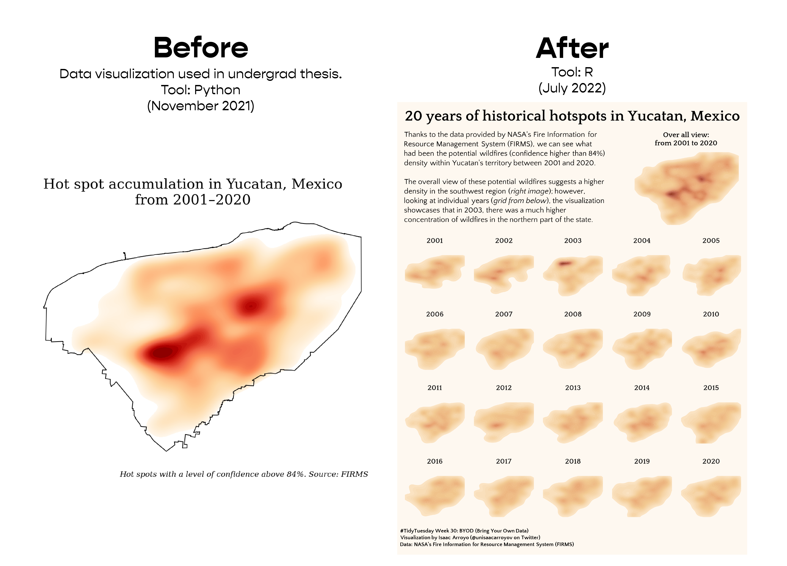

# Redesigning Data Visualizations: A glimpse of my undergraduate thesis project.

## Introduction

In order to graduate with BSc. in Engineering Physics, I had to write a thesis project. My supervisor and
I chose a topic related to the environment 🌱 : **Wildfires in the state of Yucatan** 🇲🇽

The thesis project was focused on gathering, cleaning, exploring and visualizing data concerning wildfires
(time series, records and environmental data). Some sources were public data from government institutions,
specialized databases and satellite imagery 🛰️ :earth_americas:

With this repository, **I aim to redesign some (not all) of my favourite and relevant data visualizations I
created for my undergrad thesis**. Some of the new designs will showcase a different picture of the
data, and others perhaps will explore my creativity and desire to _play_ with shapes, colours and
concepts. Therefore, no matter the case, I will receive feedback.

See the whole project in my portfolio ["Redesigning Data Visualizations: Undergrad Thesis"](https://unisaacarroyov.myportfolio.com/redesigning-data-visualizations-undergrad-thesis)

## Gallery
### Counties/Municipalities info: Frequency and affected area caused by wildfires during 2017
[**Data processing code**](https://github.com/isaacarroyov/thesis_undergrad_dataviz_redesign/blob/main/python_scripts/01_data-processing_municipalities-info.py)  
[**Data visualization code**](https://github.com/isaacarroyov/thesis_undergrad_dataviz_redesign/blob/main/r_scripts/01_data-visualization_municipalities-info.R)

### Time series: Record of heat points in the state, from 2001 to 2020
[**Data processing code**](https://github.com/isaacarroyov/thesis_undergrad_dataviz_redesign/blob/main/python_scripts/02_data-processing_time-series-heatpoints.py)  
**Data visualization made with RAWGraphs and Illustrator**

### Density plot: 
[**Data processing adn visualization code _(#TidyTuesday repository)_**](https://github.com/isaacarroyov/tidy_tuesday_R/blob/main/gallery_2022/2022_week-30_byod.R)

